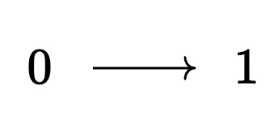
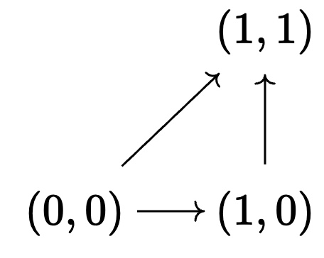
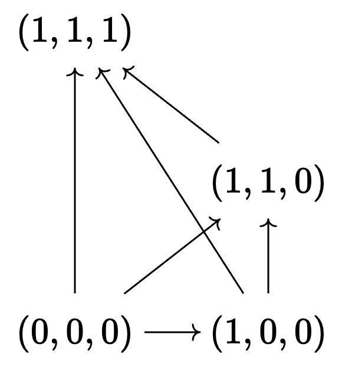
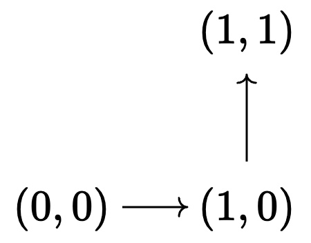

# Synthetic Lecture 2: Simplicial HoTT and first steps with Segal types


With the basics in HoTT from Lecture 1, we are now ready to introduce the simplicial extension due to Riehl--Shulman. We want to do higher category theory synthetically. We have seen how in homotopy type theory every type is an $\infty$-groupoid. But how do we get a working theory of $\infty$-categories? In simplicial HoTT, the approach is to introduce an axiomatic directed interval, defining the shape of a morphism that need not necessarily be invertible. We describe the setup in sHoTT and Rzk to achieve this.

## §2.1. Motivation

We have the following

**Goal:** Introduce shapes into HoTT such that get the following:

1. Shape $\Delta^1$ such that a term in $\Delta^1 \to A$ defines an arrow (morphism) in $A$

2. Shape $\Lambda_1^2$ such that a term in $\Lambda_1^2 \to A$ defines a pair of composable arrows in $A$

3. Shape $\Delta^2$ such that a term in $\Delta^2 \to A$ defines a pair of composable arrows in $A$ together with their composite

Furthermore, maps between those shapes should give *restriction maps* between the ensuing types, e.g.:

$$ d^0, d^1, d^2 : (\Delta^1 \to \Delta^2)$$

$$\rightsquigarrow (d_0)^*, (d_1)^*, (d_2)^* : \left((\Delta^2 \to A) \to (\Delta^1 \to A) \right)$$

$$ i : (\Lambda_1^2 \to \Delta^2 )$$
$$\rightsquigarrow i^* : \left((\Delta^2 \to A) \to (\Lambda_1^2 \to A) \right)$$

One way to tackle this is as follows. Let us assume a directed interval type $\Delta^1$. Then we could define the type of arrows in a type $A$ as follows:

$$ \hom_A(x,y) \stackrel{(?)}{:\equiv} \sum_{f : \Delta^1 \to A} (x =_A f(0)) \times (f(1) =_A y) $$

Terms in this type are morphisms *up to homotopy*, i.e. triples $\langle f, p, q \rangle$ where $p,q$ are paths $p : x = f(0)$ and $q : f(1) = y$:

$$ x \stackrel{p}{=} f(0) \stackrel{f}{\longrightarrow} f(1) \stackrel{q}{=} y$$

Given the intensional character of our identity types, we cannot necessarily conclude that $f(0) \equiv x$ and $f(1) \equiv y$, so we have to keep track about the homotopical data. This becomes difficult to work with quite quickly.

Thus, we will choose a different route:

1. We will introduce **subshapes** such as

 $$\partial \Delta^1 \subseteq \Delta^1, \quad  \Delta^1 \subseteq \Delta^2,  \quad \Lambda_1^2 \subseteq \Delta^2.$$

 2. Then we will introduce strict **extension types** to define arrows with strictly defined domain and codomain, i.e.,

 $$ x  \stackrel{f}{\longrightarrow}  y$$

rather than

$$ x \stackrel{p}{=} f(0) \stackrel{f}{\longrightarrow} f(1) \stackrel{q}{=} y$$

But this comes at a price:

* We have to introduce shapes as a separate syntactic layer.
* But this then will allows us to strictify shapes and diagrams.

**Idea:**

If $\psi$ is a shape, then a **subshape** $\varphi \subseteq \psi$ is a family of propositions

$$ \varphi : \psi \to \mathrm{Tope},$$

where $\mathrm{Tope}$ captures syntactic propositions in a special language built out of

$$ \equiv, \quad \land, \quad \lor, \quad \bot, \quad \top, \quad \leq, \quad 0_2, \quad 1_2 $$

and where the variables $r,s,t, \ldots$ come from directed cubes:

$$ 1, \quad  2, \quad 2 \times 2, \quad 2 \times 2 \times 2, \ldots $$


**There is more to say about how to set up shape theory properly. We will only birefly glance at this in the notes. But the above is all the upshot you will need for Rzk.**

## §2.2. Shapes in simplicial HoTT

Recall that in ordinary dependent type theory types depend on contexts:

$$ \Gamma \vdash A $$

In sHoTT, we want our types to not only depend on other types but geometric **shapes**. This is done by adding new layers to the type theory with their corresponding notion of context.

Concretely, a general family depends on a multi-part context

$$ \Xi \; | \; \Phi \; | \; \Gamma \vdash A$$

where:

* $\Xi$ is a **cube context**
* $\Phi$ is a **tope context**
* $\Gamma$ is a **type context**

1. The **cube layer** is a non-dependent type theory, generated by the following:

* the terminal cube $1$ *aka* the **$0$-cube** with a unique term $1_1 \in 1$.

* a directed interval $2$ *aka* the **$1$-cube** with two terms $0_2, 1_2 : 2$

* for every pair of cubes $I, J$ the cartesian product $I \times J$ is again a cube

2. A **tope** is a formula over a cube generated from:

* **equality topes** of the form $s \equiv t$ for $s,t : I$, for a cube $I$
* **inequality topes** of the form $s \leq t$ for $s,t : 2$
* the minimal and maximal topes $\bot, \top$
* finite conjunction $\land$ and finite disjunction $\lor$

Tope formulas live over a cube context:

$$ \Xi \; |\; \varphi \; \; \text{tope}$$

Moreover, a tope formula can be entailed by a tope context (over a common cube):

$$ \Xi  \; |\; \Phi \vdash \psi \; \; \text{tope}$$

A cube $I$ together with a tope formula $\varphi$ is called a **shape**, written $\{ t : I \; | \; \varphi(t)\}$.

If $I \; | \; \varphi \vdash \psi$, we say that the shape defined by $\varphi$ is a **subshape** of $\psi$, and we write:

$$ \{ t : I \; | \; \varphi(t)\} \subseteq \{ t : I \; | \; \psi(t)\}, $$
or, for short:
$$ \varphi \subseteq \psi.$$

We show below the following important shapes together with their definitions in Rzk.

The representation of (sub-)topes/shapes in Rzk is analogous to the presentation of ordinary dependent types, i.e., as a family into an appropriate universe:

| sHoTT                                                 | Rzk              |
|-------------------------------------------------------------|------------------|
| type $\; \vdash A$                                          | `A:U`            |
| dependent type $x : A \vdash B(x)$                          | `B:A -> U`       |
| cube $I$                                                    | `I : CUBE`       |
| tope/shape $t : I \vdash \varphi(t)$                        | `Φ : I → TOPE`   |
| subtope/subshape $t : I \; \| \; \varphi(t) \vdash \psi(t)$ | `ϕ : ψ → TOPE `  |

* **$1$-simplex $\Delta^2$:**



The **$1$-simplex** is the $1$-cube:
$$ \Delta^1 :\equiv \{t : 2 \; | \; \top \}$$

```rzk

#lang rzk-1

#def Δ¹
  : 2 → TOPE
  := \ t → TOP
```

The **boundary of the $1$-simplex** is a pair of isolated points:

$$ 0 \; \bullet \qquad 1 \; \bullet$$

$$\partial \Delta^1 :\equiv \{t : 2 \; | \; t \equiv 0_2 \lor t \equiv 1_2 \}$$
```rzk
#def ∂Δ¹
  : Δ¹ → TOPE
  := \ t → (t ≡ 0₂ ∨ t ≡ 1₂)
```

* **$2$-simplex $\Delta^2$:**



The **$2$-simplex** is (chosen to be) the following square in $2 \times 2$:

$$ \Delta^2 :\equiv \{ (t,s) : 2 \times 2 \; | \; s \leq t \} $$
```rzk
#def Δ²
  : ( 2 × 2) → TOPE
  := \ (t , s) → s ≤ t
```

* **$3$-simplex $\Delta^3$:**



$$ \Delta^3 :\equiv \{((t_1, t_2),t_3) : 2 \times 2 \times 2 \; | \; t_3 \leq t_2 \land t_2 \leq t_1 \} $$

```rzk
#def Δ³
  : ( 2 × 2 × 2) → TOPE
  := \ ((t1 , t2) , t3) → t3 ≤ t2 ∧ t2 ≤ t1
```

* **$(2,1)$-horn $\Lambda_1^2$:**



We can capture the $(2,1)$-horn as subshape of the $2$-cube:
$$\Lambda :\equiv \{ (t,s) : 2 \times 2 \; | \; s \equiv 0_2 \lor t \equiv 1_2\}$$

```rzk
#def Λ
  : ( 2 × 2) → TOPE
  := \ (t , s) → (s ≡ 0₂ ∨ t ≡ 1₂)
```

But we often will want to use the the $(2,1)$-horn as a subshape of the *$2$-simplex*:

$$\Lambda_1^2 :\equiv \{ (t,s) : \Delta^2 \; | \; s \equiv 0_2 \lor t \equiv 1_2\}$$

```rzk
#def Λ²₁
  : Δ² → TOPE
  := \ (t , s) → Λ (t , s)
```

**So a shape always comes with an explicit emebdding to a specified larger shape or cube!**


## §2.3. Extension types in simplicial HoTT

We can now introduce extension types to define our strict hom-types. This will be a brief overview; we will hear a more thorough discussion on extension types by Elif on Thursday.

* Let $\phi \subseteq \psi$ be a shape inclusion.
* Let $t : \phi \vdash a(t) : A$.

We now want to consider all the terms $t : \psi \vdash b(t) : A$ that *extend* $a$, and *strictly* so:

$$ t : \phi \vdash a(t) \equiv b(t) $$

This cannot be defined in our type theory, so we add as a primitive the **extension type** associated to the data $(A, \phi \subseteq \psi, a)$:

$$ \langle \psi \to A |^\phi_a \rangle $$

The syntax looks like a function type, only with some imposed side conditions---and that's exactly right. The terms $b : \langle \psi \to A |^\phi_a \rangle$ are dependent terms

$$ t : \psi \vdash b(t) : A $$

that also satisfy:

$$ t : \phi \vdash b(t) \equiv a(t) $$


| sHoTT                                                 | Rzk              |
|-------------------------------------------------------------|------------------|
| type $\; \vdash A$                                          | `A:U`            |
| dependent type $x : A \vdash B(x)$                          | `B:A -> U`       |
| cube $I$                                                    | `I : CUBE`       |
| tope/shape $t : I \vdash \varphi(t)$                        | `Φ : I → TOPE`   |
| subtope/subshape $t : I \; \| \; \varphi(t) \vdash \psi(t)$ | `ϕ : ψ → TOPE `  |
| term over shape $t : \varphi(t) \vdash b(t) : A$            | `b : ϕ → A`      |
| extension type $\langle \psi \to A \rangle$                 | `(t : ψ) → A [ϕ t ↦ a t]`|


## §2.4. Morphisms in a type

Let $A$ be a type and $x,y:A$. We will use the extension types to define types of **arrows** or **morphisms** in $A$. The idea is that an arrow $x \to y$ should have the shape of the interval $\Delta^1$ with the initial vertex labeled $x$ and the terminal vertex labeled $y$.

In sHoTT we define this as:

$$\hom_A(x,y) := \left \langle \Delta^1 \to A |^{\partial \Delta^1}_{[x,y]}\right\rangle$$

In Rzk, the notation is:

```rzk
#def hom
  ( A : U)
  ( x y : A)
  : U
  :=
  ( t : Δ¹)
  → A [ t ≡ 0₂ ↦ x , -- the left endpoint is exactly `x`
        t ≡ 1₂ ↦ y ] -- the right endpoint is exactly `y`
```

For every term $x : A$ we can define the **identity morphism** as the morphism that is constant at $x$:

$$ \mathrm{id}_x :\equiv \lambda t.x : \hom_A(x,x)$$

Can you write this in Rzk?

```rzk
#def id-hom (A : U) (x : A)
  : hom A x x
  := \ t → x
```

To talk about composition, we need to reason about triangles. Let $x,y,z : A$, $f : \hom_A(x,y)$, $g : \hom_A(y,z)$, and $h : \hom_A(x,z)$. We define the type of triangles with boundary consisting of those morphisms as:

$$ \hom_{A,x,y,z}^2(f,g,h) :\equiv \left \langle \Delta^2 \to A |^{\partial \Delta^2}_{[f,g,h]}\right\rangle$$

In Rzk, this can be implemented as follows using case-splits on the dimension variables on the simplex:

```rzk
#def hom2
  ( A : U)
  ( x y z : A)
  ( f : hom A x y)
  ( g : hom A y z)
  ( h : hom A x z)
  : U
  :=
  ( ( t₁ , t₂) : Δ²)
  → A [ t₂ ≡ 0₂ ↦ f t₁ , -- the top edge is exactly `f`,
        t₁ ≡ 1₂ ↦ g t₂ , -- the right edge is exactly `g`, and
        t₂ ≡ t₁ ↦ h t₂]  -- the diagonal is exactly `h`
```

There are some canonical triangles in every type, regardless if it's a category or not:


E.g., the leftmost one is given by:

```rzk
#def const-triangle (A : U) (x : A)
  : hom2 A x x x
    ( id-hom A x) (id-hom A x) (id-hom A x)
  := \ (t , s) → x
```

Being üart of the axiomatics of a category, these should witness unitality of the identity morphism. But we don't even have a notion of composition yet!

## §2.5. Segal types

We want to express the property of a type having composition of arrows (as witnessed by a $2$-simplex) uniquely up to homotopy. Namely, we call a type $A$ **Segal** if and only if the following proposition is satisfied:

$$ \text{is-Segal}(A) :\equiv \prod_{x,y,z:A} \prod_{f : \hom_A(x,y)}\prod_{g : \hom_A(y,z)} \text{is-contr}\left( \sum_{h : \hom_A(x,z)}\hom_A^2(f,g,h) \right) $$

In Rzk, this translates into:

```rzk
#def is-segal
  ( A : U)
  : U
  :=
  ( x : A) → (y : A) → (z : A)
  → ( f : hom A x y) → (g : hom A y z)
  → is-contr (Σ (h : hom A x z) , (hom2 A x y z f g h))
```

  It will be handy to extract the pieces of the "canonical" composition data through the following helper functions. The data is comprised out of:
  1. a composite morphism ($1$-simplex) $\mathrm{comp}_A(f,g)$
  2. a triangle ($2$-simplex) bounded $f$, $g$, and $\mathrm{comp}(f,g)$:

```rzk
#def comp-is-segal
  ( A : U)
  ( is-segal-A : is-segal A)
  ( x y z : A)
  ( f : hom A x y)
  ( g : hom A y z)
  : hom A x z
  := first (first (is-segal-A x y z f g))

#def witness-comp-is-segal
  ( A : U)
  ( is-segal-A : is-segal A)
  ( x y z : A)
  ( f : hom A x y)
  ( g : hom A y z)
  : hom2 A x y z f g (comp-is-segal A is-segal-A x y z f g)
  := second (first (is-segal-A x y z f g))
```

Indeed, we can now prove that the Segal condition implies the unique existence of composite morphisms. Whenever there exists a candidate composite edge $h : \hom_A(x,z)$, fitting into a $2$-simplex $\alpha : \hom_A^2(f,g,h)$, then we can construct a path from the canonical composite as constructed above.

For this, we need some prerequisites about paths in sHoTT:

```rzk
#def ap
  ( A B : U)
  ( x y : A)
  ( f : A → B)
  ( p : x = y)
  : f x = f y
  := ?
```

```rzk
#def first-path-Σ
  ( A : U)
  ( B : A → U)
  ( s t : Σ (a : A) , B a)
  ( e : s = t)
  : first s = first t
  := ?
```

```rzk
#def uniqueness-comp-is-segal
  ( A : U)
  ( is-segal-A : is-segal A)
  ( x y z : A)
  ( f : hom A x y)
  ( g : hom A y z)
  ( h : hom A x z)
  ( alpha : hom2 A x y z f g h)
  : ( comp-is-segal A is-segal-A x y z f g) = h
  :=
  first-path-Σ
  ( hom A x z)
  ( hom2 A x y z f g)
  ( comp-is-segal A is-segal-A x y z f g
    , witness-comp-is-segal A is-segal-A x y z f g)
  ( h , alpha)
  ( homotopy-contraction
    ( Σ ( k : hom A x z) , (hom2 A x y z f g k))
    ( is-segal-A x y z f g)
    ( h , alpha))
```
