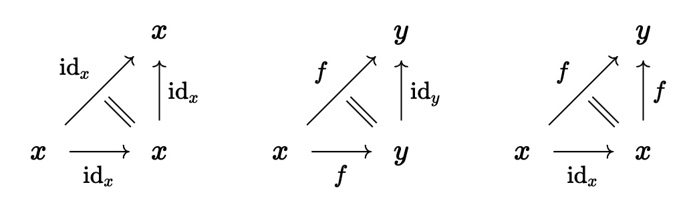

# Synthetic Lecture 3: Category theory with Segal types

```rzk
#lang rzk-1
```

Our Segal types are supposed to (almost) play the role of $\infty$-category. What is particularly nice in our setting is that we get a lot of the desired properties **for free**, including functoriality and naturality.

For example, let $A$ and $B$ Segal types. Then the function type $A \to B$ is also Segal, and any *function* $f : A \to B$ is already a *functor*.

It follows that the function type $A \to B$ plays the role of the **functor category**. The definition of natural transformation becomes particularly easy: for $f,g : A \to B$ a **natural transformations** is simply a term $\alpha : \hom_{A \to B}(f,g)$. Using the calculus of extension types, one can then show that we get the expected naturality square for free.

To formally prove all this in Rzk, we need quite a bit of setup. But some early consequences are easy to get, which we will see in the following.

## §2.1 Identities

Recall the identity triangles:



Let's try to formalize the two non-constant identity triangles:

```rzk
#def comp-id-witness
  ( A : U)
  ( x y : A)
  ( f : hom A x y)
  : hom2 A x y y f (id-hom A y) f
  := ?
```

```rzk
#def id-comp-witness
  ( A : U)
  ( x y : A)
  ( f : hom A x y)
  : hom2 A x x y (id-hom A x) f f
  := ?
```

So far these are just triangles. The actual identity laws should be given by paths

$$ p : \mathrm{id}_y \circ f = f, \quad q : f \circ \mathrm{id}_x = f. $$

**Question:** How can we get these identities?

```rzk
#def comp-id-is-segal
  ( A : U)
  ( is-segal-A : is-segal A)
  ( x y : A)
  ( f : hom A x y)
  : ( comp-is-segal A is-segal-A x y y f (id-hom A y)) = f
  :=
    uniqueness-comp-is-segal
      ( A)
      ( is-segal-A)
      ( x) (y) (y)
      ( f)
      ( id-hom A y)
      ( f)
      ( comp-id-witness A x y f)
```

```rzk
#def id-comp-is-segal
  ( A : U)
  ( is-segal-A : is-segal A)
  ( x y : A)
  ( f : hom A x y)
  : ( comp-is-segal A is-segal-A x x y (id-hom A x) f) =_{hom A x y} f
  :=
    uniqueness-comp-is-segal
      ( A)
      ( is-segal-A)
      ( x) (x) (y)
      ( id-hom A x)
      ( f)
      ( f)
      ( id-comp-witness A x y f)
```

## §2.2. Functors

A functor $F : A \to B$ should have an action on both objects and morphisms. We will show how to get a map

$$ \text{ap-hom}_F : \prod_{x,y:A} \hom_A(x,y) \to \hom_B( F(x), F(y)). $$

```rzk
#def ap-hom
  ( A B : U)
  ( F : A → B)
  ( x y : A)
  ( f : hom A x y)
  : hom B (F x) (F y)
  := ?

```

Thus, indeed we get an action arrows from just a function $F : A \to B$.

We also get an action on $2$-simplices:

```rzk
#def ap-hom2
  ( A B : U)
  ( F : A → B)
  ( x y z : A)
  ( f : hom A x y)
  ( g : hom A y z)
  ( h : hom A x z)
  ( α : hom2 A x y z f g h)
  : hom2 B (F x) (F y) (F z)
    ( ap-hom A B F x y f) (ap-hom A B F y z g) (ap-hom A B F x z h)
  := ?
```
$$ \text{ap-hom}_F(f) \equiv: F(f) $$

Using the action on arrows, triangles, and uniqueness of composition we can now prove composition in the sense that we can construct a term in

$$ F(g) \circ F(f) =_{\hom_B(F(x), F(z))} F(g \circ f),$$

or, in Rzk syntax:


$$ \text{comp}_B( \text{ap-hom}_F(f), \text{ap-hom}_F(g))
=_{\hom_B(F(x), F(z))}
\text{ap-hom}_F(\text{comp}_A(f,g)),$$


```rzk
#def functors-pres-comp
  ( A B : U)
  ( is-segal-A : is-segal A)
  ( is-segal-B : is-segal B)
  ( F : A → B)
  ( x y z : A)
  ( f : hom A x y)
  ( g : hom A y z)
  :
    ( comp-is-segal B is-segal-B
      ( F x) (F y) (F z)
      ( ap-hom A B F x y f)
      ( ap-hom A B F y z g))

  = ( ap-hom A B F x z (comp-is-segal A is-segal-A x y z f g))
  :=
    uniqueness-comp-is-segal B is-segal-B
      ( F x) (F y) (F z)
      ( ap-hom A B F x y f)
      ( ap-hom A B F y z g)
      ( ap-hom A B F x z (comp-is-segal A is-segal-A x y z f g))
      ( ap-hom2 A B F x y z f g
        ( comp-is-segal A is-segal-A x y z f g)
        ( witness-comp-is-segal A is-segal-A x y z f g))
```

To prove preservation of identities we need a certain **extensionality axiom** that we have not discussed yet (cf. Elif's talk today).

But assuming this property, which connects the strict extension types to the homotopy theory of types, we can also prove preservation of identity arrows in a similar way.

## §2.3. Natural transformations

We define the type of natural transformations of functors $f,g :A \to B$ as

$$ \mathrm{nat}(f,g) :\equiv \hom_{A \to B}(f,g). $$

It's not more expensive to define this for the dependent case, where $f,g : \prod_{x:A} B(x)$ are **dependent** functions:

$$ \mathrm{nat}(f,g) :\equiv \hom_{(x:A) \to B(x)}(f,g). $$

This showcases another big strength of dependent type theory.

```rzk
#def nat-trans
  ( A : U)
  ( B : A → U)
  ( f g : (x : A) → (B x))
  : U
  := ?
```

It will turn out that this is equivalent to the **component-wise** natural transformations:

$$\mathrm{nat-compw}(f,g) :\equiv \prod_{x:A} \hom_{B(x)}(f(x),g(x))$$

```rzk
#def nat-trans-components
  ( A : U)
  ( B : A → U)
  ( f g : (x : A) → (B x))
  : U
  := ?
```

One can then show that these are actually equivalent.
